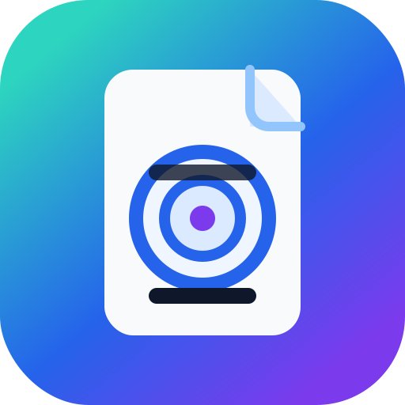

<p align="center">
  
</p>

<h1 align="center">goal-creator</h1>

<p align="center">
  A concise goal maker for AI coding agents.
  <br>
  Keep the chat command short. Put the full plan in a saved goal file.
</p>

<p align="center">
  <a href="#english">English</a> ·
  <a href="#中文">中文</a>
</p>

<p align="center">
  <code>codex</code>
  <code>claude-code</code>
  <code>gemini</code>
  <code>cursor</code>
  <code>windsurf</code>
  <code>cline</code>
  <code>github-issues</code>
  <code>markdown</code>
  <code>ai-agents</code>
  <code>goal-management</code>
</p>

---

## English

`goal-creator` is a small skill for turning vague work into compact commands plus complete saved goals.

Think of it as a tidy little mission writer:

```text
"Please improve the backtest module"
        ↓
.goals/2026-06-20-refactor-backtest-module.md
        ↓
A short launcher plus a complete Codex / Claude / Gemini / Cursor / GitHub-ready goal spec
```

It avoids giant chat prompts. The chat command stays short; the saved `.goals/*.md` file keeps the full plan.
It also preserves the original request so later execution cannot quietly weaken the acceptance bar.
For non-English goals, headings, labels, launcher wording, and prose stay in the target language.
Full-spec goals include a multi-agent-first collaboration contract with slice ownership, subagent deliverables, merge policy, and rejection conditions.
It can also create a Codex subagent capacity setup goal for `~/.codex/config.toml` when requested.
Creating a goal does not execute it. Paste or invoke the returned launcher only when you want the agent to start.

### What It Does

- Creates concise launcher commands from plain-language requests.
- Saves full execution specs for detailed work.
- Saves goals into the current project under `.goals/`.
- Follows the user's language for headings and prose.
- Adds multi-agent coordination rules to full-spec goals by default.
- Adds Codex subagent capacity setup instructions when requested.
- Renders mainstream agent formats:
  - Codex `/goal`
  - Claude Code
  - Gemini / Antigravity
  - Cursor / Windsurf / Cline
  - GitHub issue
  - Generic Markdown

### Beginner Quick Start

1. Clone and install this skill into your Codex skills folder:

```powershell
git clone https://github.com/yinsang0910-star/goal-creator.git
cd .\goal-creator
python scripts\install_local.py
```

2. Restart your agent.

3. Ask:

```text
Use goal-creator to create and save a compact goal for refactoring the backtest module.
```

For every supported format:

```text
Use goal-creator to create a saved multi-format goal for building my first MVP.
```

Post-install check:

```text
Use goal-creator to create and save a full-spec goal for a small README update.
```

You should see a new file under `.goals/`.

### How To Use

Create a normal full-spec goal:

```text
Use goal-creator to create and save a full-spec goal for <your task>.
```

Create a short copyable goal:

```text
Use goal-creator to create a compact goal for <your task>.
```

Review an existing goal:

```text
Use goal-creator to review this goal for missing verification, weak boundaries, language mixing, and multi-agent gaps.
```

Create a goal that also prepares Codex subagent capacity:

```text
Use goal-creator to create and save a goal for configuring Codex subagent concurrency.
```

Run a saved goal later:

```text
/goal Read `.goals/<file>.md`; execute only that file.
```

Full-spec goals include multi-agent coordination by default. The executing main session must try substantial low-conflict slices first, consume each subagent handoff, merge serially, and run final project-level verification.

Saved full-spec goals can be checked locally:

```powershell
python scripts\lint_goal_file.py .goals\<file>.md
```

### Example Output

```text
Saved: .goals/2026-06-20-refactor-backtest-module.md

/goal Read `.goals/2026-06-20-refactor-backtest-module.md`; execute only that file.
```

The saved file contains the original request, non-negotiables, full objective, success criteria, scope, execution plan, verification, safety constraints, stop condition, and pause condition.

---

## 中文

`goal-creator` 是一个给 AI 编程 Agent 用的小工具：把模糊需求变成短启动命令和完整目标文件。

你可以把它理解成“任务翻译器”：

```text
“帮我把回测模块整理一下”
        ↓
.goals/2026-06-20-refactor-backtest-module.md
        ↓
一条短启动命令 + 一份 Codex / Claude / Gemini / Cursor / GitHub 都看得懂的完整目标文件
```

它不把又长又厚的提示词合同塞进聊天框。聊天里的 `/goal` 保持短，完整流程放进 `.goals/*.md`。
它会保留原始需求，避免后续执行时悄悄降低验收标准。
非英文目标会保持同一种目标语言，包括标题、字段标签、启动命令和正文。
full-spec 目标默认加入多代理优先协同契约，明确切片归属、子代理交付物、合并策略和拒绝条件。
用户需要时，也可以生成调整 `~/.codex/config.toml` 的 Codex 子代理并发配置目标。
创建目标不会自动执行目标。只有当你粘贴或调用返回的启动命令时，Agent 才开始执行。

### 它能做什么

- 把自然语言需求压缩成短启动命令。
- 把完整执行流程保存成目标文件。
- 自动保存到当前项目的 `.goals/` 目录。
- 标题和正文都跟随用户语言输出。
- full-spec 目标默认加入多代理协同规则。
- 按需加入 Codex 子代理并发上限配置步骤。
- 支持主流 Agent 格式：
  - Codex `/goal`
  - Claude Code
  - Gemini / Antigravity
  - Cursor / Windsurf / Cline
  - GitHub issue
  - 通用 Markdown

### 小白快速开始

1. 克隆仓库，并安装到 Codex skills 目录：

```powershell
git clone https://github.com/yinsang0910-star/goal-creator.git
cd .\goal-creator
python scripts\install_local.py
```

2. 重启你的 Agent。

3. 直接说：

```text
用 goal-creator 给“重构回测模块”创建并保存一个简洁目标。
```

如果你想同时兼容所有主流格式：

```text
用 goal-creator 给我的第一个 MVP 创建一个多格式目标文件。
```

安装后验证：

```text
用 goal-creator 给一次小型 README 更新创建并保存一个 full-spec 目标。
```

你应该能在 `.goals/` 目录下看到新文件。

### 怎么使用

创建普通 full-spec 目标：

```text
用 goal-creator 为“<你的任务>”创建并保存一个 full-spec 目标。
```

创建短的可复制目标：

```text
用 goal-creator 为“<你的任务>”创建一个 compact 目标。
```

检查已有目标：

```text
用 goal-creator 检查这个 goal 是否缺少验证、边界、暂停条件，是否中英混用，是否缺少多代理协同。
```

创建 Codex 子代理并发配置目标：

```text
用 goal-creator 创建并保存一个配置 Codex 子代理并发上限的目标。
```

之后执行已保存的目标：

```text
/goal 读取 `.goals/<file>.md`；只执行该文件。
```

full-spec 目标默认包含多代理协同规则。未来执行的主会话必须先尝试拆分实质性、低冲突切片，消费每个子代理交接结果，串行合并，并运行最终项目级验证。

保存后的 full-spec 目标可以本地检查：

```powershell
python scripts\lint_goal_file.py .goals\<file>.md
```

### 输出长什么样

```text
Saved: .goals/2026-06-20-refactor-backtest-module.md

/goal Read `.goals/2026-06-20-refactor-backtest-module.md`; execute only that file.
```

原始需求、不可降级项、完整目标、成功标准、范围、执行计划、验证方式、安全约束、停止条件和暂停条件都保存在目标文件里。
