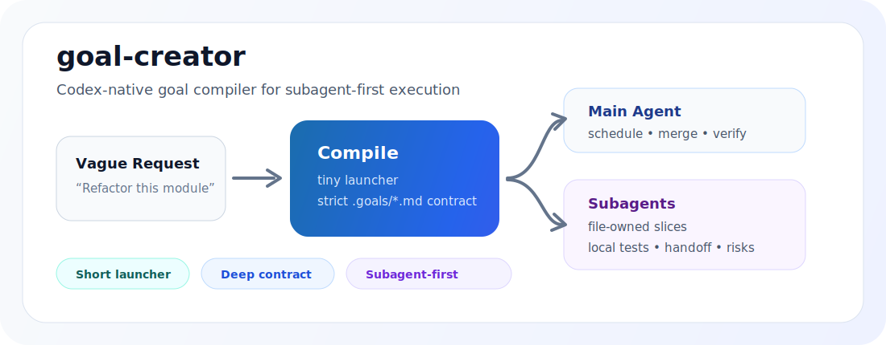

<p align="center">
  
</p>

<h1 align="center">goal-creator</h1>

<p align="center">
  <strong>Short launcher. Deep contract. Subagent-first execution.</strong>
  <br>
  Codex-native goal compiler for turning vague work into strict, resumable, multi-agent execution contracts.
</p>

<p align="center">
  <a href="#english">English</a> ·
  <a href="#中文">中文</a>
</p>

<p align="center">
  <code>codex</code>
  <code>subagents</code>
  <code>goals</code>
  <code>skills</code>
  <code>claude-code</code>
  <code>gemini</code>
  <code>cursor</code>
  <code>windsurf</code>
  <code>github-issues</code>
</p>

---

## English

`goal-creator` turns a loose request into two things:

```text
/goal Execute only `.goals/<file>.md`.
```

and a saved `.goals/*.md` file that carries the real execution contract: original request, non-negotiables, success criteria, scope, verification, stop/pause conditions, Codex config prerequisites, and a subagent dispatch plan.

It is built for Codex work where the main session should not burn context doing every detail itself. Full-spec goals make the main agent act as scheduler, merger, boundary judge, and final verifier, while subagents handle isolated, file-owned execution slices.

### Why It Exists

Long `/goal` prompts are hard to review, easy to truncate, and easy for future agents to weaken. A short launcher plus a saved contract is easier to resume, lint, commit, review, and execute.

`goal-creator` is designed to prevent common agent failure modes:

- shrinking the user's original request into a smaller MVP without saying so
- mixing English headings into Chinese goals
- using subagents only for summaries instead of real execution
- making every task multi-agent even when L0 single-agent work is enough
- forgetting Codex subagent capacity configuration before relying on parallel work

### Codex-Native Model

Full-spec goals include these contracts by default:

- **Codex Execution Contract**: project root, `AGENTS.md`, `.goals/*.md`, `git status --short`, `git diff --check`, and project verification
- **Subagent Capacity Prerequisite**: required `~/.codex/config.toml` `[agents]` setup before subagent-first work
- **Subagent Dispatch Decision**: L0/L1/L2/L3 precision so simple work stays simple and complex work gets real parallelism
- **Subagent Execution Liberation**: main agent schedules, merges, handles boundaries, and verifies; subagents execute isolated work
- **Dispatch Matrix**: file-owned slices with allowed files, forbidden files, verification, dependencies, and merge owner
- **Subagent Result**: structured handoff with changed files, verification result, boundary crossings, risks, and merge notes

Dispatch levels:

| Level | Use When |
| --- | --- |
| L0 | Single-file small edit, simple explanation, simple command, wording tweak |
| L1 | One isolated reader/verifier/risk-review subagent is useful |
| L2 | 2-3 file-owned slices can work in parallel, usually code plus tests/docs |
| L3 | 4+ slices for migrations, broad refactors, investigations, or batch fixes |

### Install

```powershell
git clone https://github.com/yinsang0910-star/goal-creator.git
cd .\goal-creator
python scripts\install_local.py
```

Configure Codex subagent capacity in `~/.codex/config.toml` before relying on full-spec subagent-first goals:

```toml
[agents]
max_threads = 2147483647
max_depth = 2147483647
```

If `[agents]` already exists, update only those fields. Do not delete or reorder existing config.

Verify Codex loads the config:

```powershell
codex --strict-config doctor --summary --ascii
```

Confirm `Configuration` / `config` is `loaded`, then restart Codex.

### Use

Create a normal full-spec goal:

```text
Use goal-creator to create and save a full-spec goal for refactoring the backtest module.
```

Create a compact goal for trivial work:

```text
Use goal-creator to create a compact goal for a README typo fix.
```

Review an existing goal:

```text
Use goal-creator to review this goal for weak acceptance criteria, missing verification, language mixing, and fake subagent dispatch.
```

Run a saved goal later:

```text
/goal Execute only `.goals/<file>.md`.
```

### Output Shape

Chat stays small:

```text
Saved: .goals/2026-06-20-refactor-backtest-module.md

/goal Execute only `.goals/2026-06-20-refactor-backtest-module.md`.
```

The saved file carries the actual execution contract. That file is the artifact future agents should read, resume, lint, and execute.

### Quality Checks

```powershell
python scripts\smoke_test.py
python scripts\lint_goal_file.py examples\full-spec-goal.md
python scripts\check_eval_cases.py
git diff --check
```

Use the linter on generated goals:

```powershell
python scripts\lint_goal_file.py .goals\<file>.md
```

---

## 中文

`goal-creator` 会把一句模糊需求变成两样东西：

```text
/goal 只执行 `.goals/<file>.md`
```

以及一个保存到 `.goals/*.md` 的完整目标契约。真正的执行要求不塞进聊天框，而是放进目标文件：原始需求、不可降级项、成功标准、范围、验证方式、停止/暂停条件、Codex 配置前置、子代理派发计划。

它不是普通的“帮你写 goal”。它的定位是 **Codex 原生任务编译器**：让主会话少消耗上下文，不再亲自做所有执行细节。full-spec 目标会让主 agent 退到调度、合并、边界裁决和最终验收的位置，把可隔离、可验证、可交付的执行工作下放给子代理。

### 为什么需要它

很长的 `/goal` 提示词难审查、容易截断，也容易被后续 agent 悄悄降级。短启动入口 + 保存的目标契约更适合恢复、检查、提交、审阅和执行。

`goal-creator` 重点防这些问题：

- 把用户原始需求偷偷缩小成 MVP
- 中文目标里混入英文标题和字段
- 子代理只做摘要，不做真正可合并的执行工作
- 简单任务也强行派一堆无效子代理
- 依赖子代理并发前，没有先配置 Codex 的 agents 容量

### Codex 原生执行模型

full-spec 目标默认包含这些契约：

- **Codex 执行契约**：项目根目录、`AGENTS.md`、`.goals/*.md`、`git status --short`、`git diff --check`、项目级验证
- **子代理容量前置**：使用 subagent-first 前必须配置 `~/.codex/config.toml` 的 `[agents]`
- **子代理派发决策**：用 L0/L1/L2/L3 精准判断，简单任务保持简单，复杂任务释放并行能力
- **子代理执行力释放**：主 agent 负责调度、合并、边界和最终验证；子代理负责隔离执行
- **派发表**：按文件所有权拆分切片，明确允许文件、禁止文件、验证命令、依赖和合并负责人
- **子代理结果**：固定交付格式，包含改动文件、验证结果、越界情况、风险和交接说明

派发等级：

| 等级 | 适用情况 |
| --- | --- |
| L0 | 单文件小修、简单解释、简单命令、文案微调 |
| L1 | 一个子代理做隔离阅读、局部验证或风险检查 |
| L2 | 2-3 个文件边界清楚的切片并行，通常是代码 + 测试/文档 |
| L3 | 4 个以上切片，用于迁移、大重构、大范围排查或批量修复 |

### 安装

```powershell
git clone https://github.com/yinsang0910-star/goal-creator.git
cd .\goal-creator
python scripts\install_local.py
```

依赖 full-spec / subagent-first 目标前，先配置 `~/.codex/config.toml`：

```toml
[agents]
max_threads = 2147483647
max_depth = 2147483647
```

如果已经有 `[agents]` 段，只更新这两个字段。不要删除或重排现有配置。

验证 Codex 能加载配置：

```powershell
codex --strict-config doctor --summary --ascii
```

确认 `Configuration` / `config` 是 `loaded`，然后重启 Codex。

### 使用

创建普通 full-spec 目标：

```text
用 goal-creator 为“重构回测模块”创建并保存一个 full-spec 目标。
```

为简单任务创建 compact 目标：

```text
用 goal-creator 为 README 错别字修复创建一个 compact 目标。
```

检查已有 goal：

```text
用 goal-creator 检查这个 goal 是否存在验收降级、缺少验证、中英混用、假子代理派发。
```

之后执行已保存目标：

```text
/goal 只执行 `.goals/<file>.md`
```

### 输出形态

聊天窗口保持很短：

```text
Saved: .goals/2026-06-20-refactor-backtest-module.md

/goal 只执行 `.goals/2026-06-20-refactor-backtest-module.md`
```

真正完整的执行要求保存在 `.goals/*.md`。未来 agent 应该读取、恢复、检查并执行这个文件，而不是依赖聊天里的一大段提示词。

### 质量检查

```powershell
python scripts\smoke_test.py
python scripts\lint_goal_file.py examples\full-spec-goal.md
python scripts\check_eval_cases.py
git diff --check
```

检查生成出的目标文件：

```powershell
python scripts\lint_goal_file.py .goals\<file>.md
```
